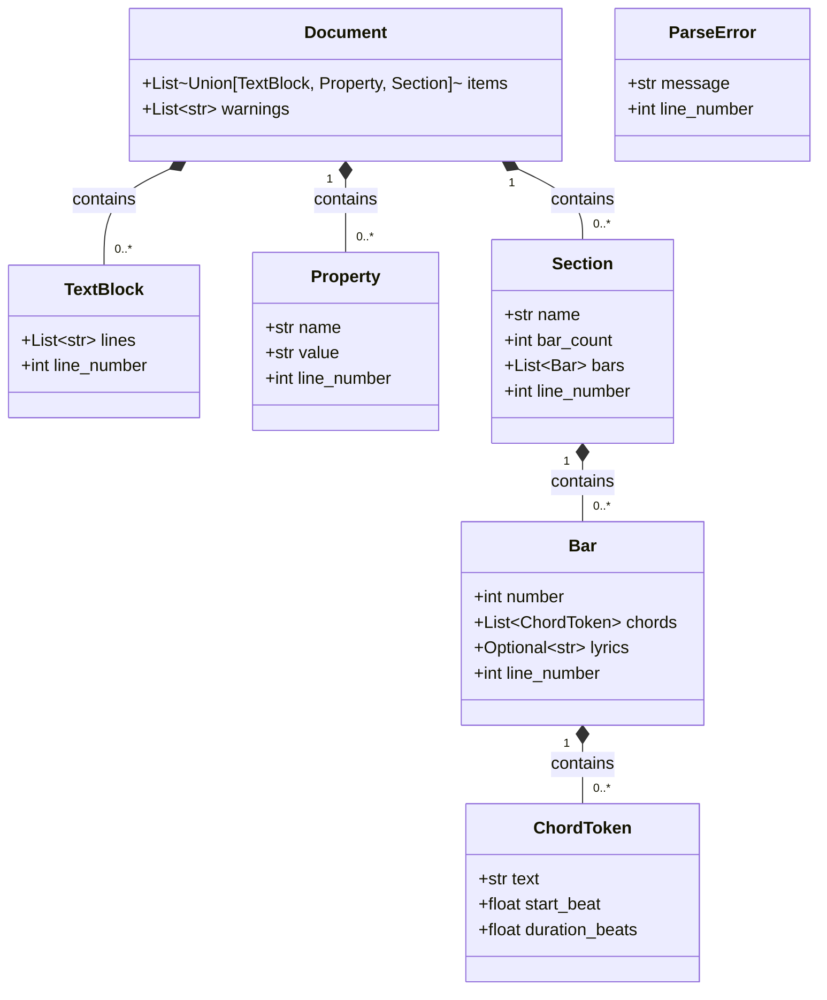
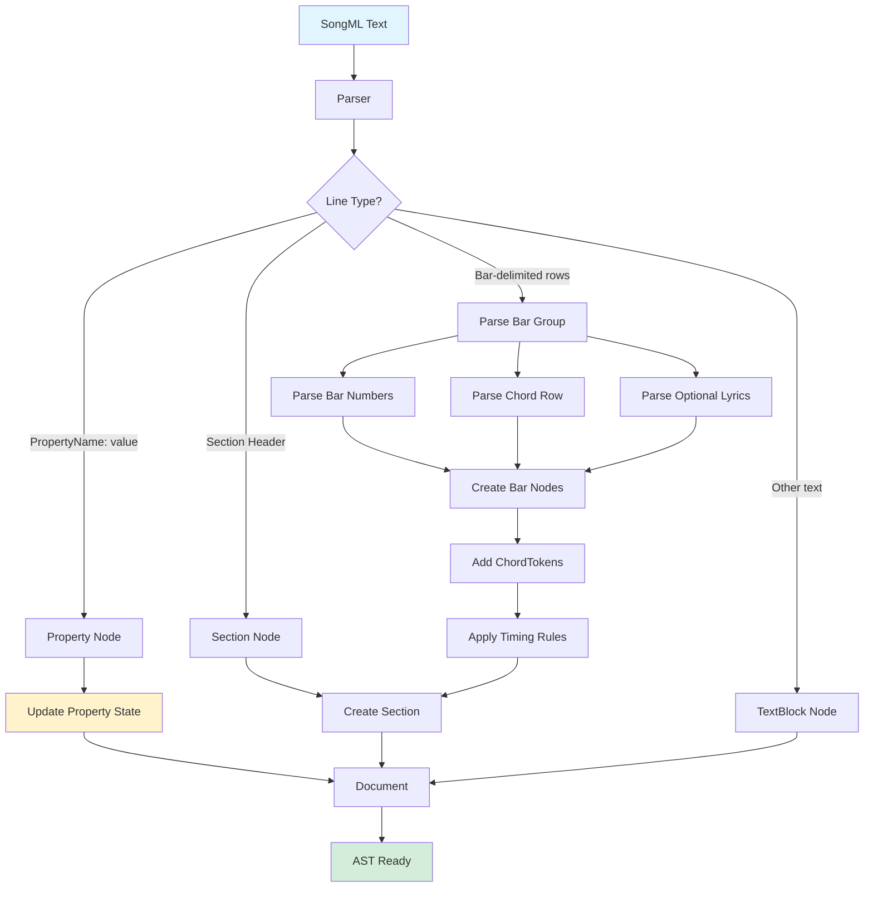
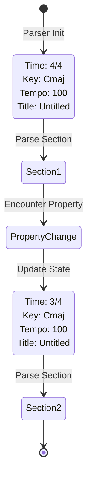
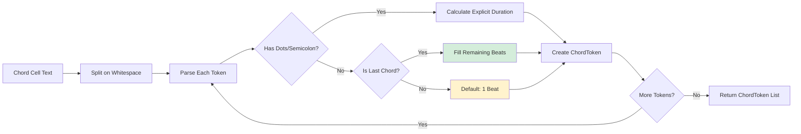

# SongML Abstract Syntax Tree

This document visualizes the AST structure used by the SongML parser.

## Class Structure

## Data Flow

## Property State Persistence

The parser maintains a property state dictionary throughout parsing. Properties encountered update this state and apply to all subsequent sections until changed:

## Timing Inference

ChordToken timing is calculated using the last-chord-fills rule:

## Round-Trip Design

The AST preserves sufficient information to enable reconstruction:

- **ChordToken**: `text` (opaque), `start_beat`, `duration_beats` → reconstruct timing markers
- **Bar**: `number`, `chords`, `lyrics` → reconstruct bar rows
- **Section**: `name`, `bar_count`, `bars` → reconstruct section header and content
- **Property**: `name`, `value` → reconstruct property declarations
- **Document**: `items` (ordered sequence) → preserves document structure
- **Document**: `warnings` → non-fatal issues for user feedback
