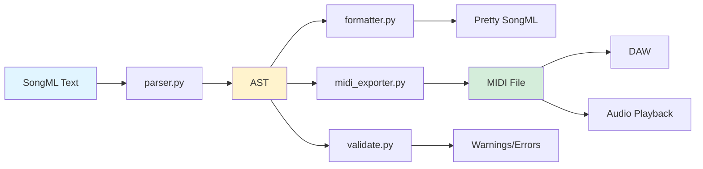

# SongML MIDI Generation

This document describes the MIDI export capability in `songml-utils`, which converts parsed SongML documents into playable MIDI files.

---

## Overview

The MIDI export module translates SongML's symbolic representation (chords, timing, properties) into Standard MIDI File format. This enables:

- **Audio playback** of chord progressions from SongML files
- **DAW import** for further arrangement and production
- **Verification** that SongML timing and structure parse correctly
- **Prototyping** musical ideas in text before detailed production

The design follows SongML's philosophy: **simple, pragmatic, and forgiving**. It doesn't attempt to capture performance nuances or sophisticated voicings—it focuses on making the harmonic structure audible and useful.

---

## Architecture

### Components

```
┌──────────────┐
│ SongML Text  │
└──────┬───────┘
       │ parse
       ↓
┌──────────────┐
│ Document AST │ (see songml-ast.md)
└──────┬───────┘
       │ export_midi()
       ↓
┌──────────────────┐      ┌────────────────────┐
│ midi_exporter.py │─────→│ chord_voicings.py  │
│                  │      │ (TSV-based lookup) │
└────────┬─────────┘      └────────────────────┘
         │
         ↓
┌──────────────┐
│  .mid file   │
└──────────────┘
```

### Key Modules

1. **`midi_exporter.py`** — Main export logic
   - `export_midi(doc: Document, output_path: str)` — Entry point
   - Timeline builder: converts AST timing → MIDI ticks
   - Property extraction: reads `Tempo`, `Time`, `Key`, `Title`
   - Event sequencing: sorts note on/off events, handles delta times

2. **`chord_voicings.py`** — Chord-to-MIDI-notes mapping
   - `get_chord_notes(chord_symbol: str, root_octave: int) → List[int]`
   - Loads literal symbol mappings from TSV for base chords
   - Special case: slash chords (e.g., `C7/G`) are parsed to add bass note

3. **`data/chord_voicings.tsv`** — Static voicing table
   - Format: `ChordSymbol<TAB>Root<TAB>Offset1,Offset2,...`
   - 90+ common chord symbols (triads, sevenths, extensions, alterations)
   - Human-readable and easily extensible

4. **`midi_cli.py`** — Command-line interface
   - `songml-to-midi INPUT.songml OUTPUT.mid`
   - Error handling and user feedback

---

## How It Works

### Step 1: Extract Properties

The exporter reads document-level properties to configure the MIDI file:

```python
tempo_bpm = int(_get_property(doc, 'Tempo', default='100'))
time_sig = _parse_time_signature(_get_property(doc, 'Time', default='4/4'))
key_sig = _parse_key_signature(_get_property(doc, 'Key', default='Cmaj'))
title = _get_property(doc, 'Title', default='Untitled')
```

**Defaults:**
- Tempo: 100 BPM
- Time: 4/4
- Key: C major
- Title: "Untitled"

### Step 2: Validate Content

Before generating MIDI, the exporter verifies:
- Document contains at least one `Section`
- At least one `Bar` has at least one `ChordToken`

If validation fails, raises `ValueError` with descriptive message.

### Step 3: Build Timeline

The exporter iterates through all sections and bars, converting AST timing into absolute MIDI ticks:

**Timing calculation:**
- **Ticks per beat:** 480 (MIDI standard "PPQ" = pulses per quarter note)
- **Bar start tick:** `absolute_bar_number × beats_per_bar × 480`
- **Chord start tick:** `bar_start_tick + (start_beat × 480)`
- **Chord duration:** `duration_beats × 480` ticks

**Critical detail:** Bars are numbered sequentially *across all sections* for timeline calculation, even though `Bar.number` resets in each section. This ensures continuous playback.

### Step 4: Convert Chords to MIDI Notes

For each `ChordToken`, the exporter:

1. Looks up `chord_token.text` in the voicing table (via `get_chord_notes()`)
2. Receives a list of MIDI note numbers (e.g., `[36, 40, 43]` for C major triad at octave 3)
3. Handles slash chords: `C7/G` → bass note `G` one octave below + `C7` voicing
4. Raises `ValueError` if chord symbol not found in table (with section/bar/beat context)

**Example:**
```
ChordToken(text="Fmaj7", start_beat=0.0, duration_beats=2.0)
→ get_chord_notes("Fmaj7", root_octave=3)
→ [41, 45, 48, 52]  # F2, A2, C3, E3
```

### Step 5: Generate Note Events

For each chord, create two events:
- **Note On** at `tick` with velocity 64, channel 0
- **Note Off** at `tick + duration_ticks`

All events are collected in a list as `(absolute_tick, event_type, note_list)`.

### Step 6: Sort and Serialize

1. **Sort events** by absolute tick, with `note_off` before `note_on` at the same tick
   - Prevents notes from overlapping incorrectly when sustained chords change
2. **Convert to delta times:** Calculate time difference from previous event
3. **Write to MIDI track** using `mido` library
   - First note in each chord group carries the delta time
   - Subsequent notes in same chord have delta time 0 (simultaneous)

### Step 7: Add Metadata and Save

- Add MIDI meta-events: track name, tempo, time signature, key signature
- Append end-of-track marker
- Save to `.mid` file

---

## Chord Voicing Design

### Philosophy: Table-Based with Minimal Parsing

**The voicing system uses a static TSV table mapping chord symbols to MIDI notes, with one pragmatic exception: slash chord bass notes.**

For most chords, there's zero parsing—just direct table lookup. Slash chords like `C7/G` are handled by splitting on `/`, looking up the base chord (`C7`), and programmatically adding the bass note one octave below.

**Why this approach?**

1. **Predictable:** Same input always produces same output (table + simple slash logic)
2. **Transparent:** Humans can inspect the voicing table and understand slash chord behavior
3. **Extensible:** Add new base chord voicings by adding TSV rows; slash chords work automatically
4. **Pragmatic:** Slash chord syntax is universal and unambiguous—parsing it is safer than maintaining hundreds of slash chord combinations in the table
5. **AI-friendly:** LLMs can generate valid chord symbols by referencing the table, and slash chords "just work"

### Voicing Table Format

```tsv
ChordSymbol<TAB>Root<TAB>Offset1,Offset2,...
```

**Example entries:**
```tsv
Cmaj7	C	0,4,7,11
C7/G	C	0,4,7,10
F9	F	0,4,7,10,14
Dm7	D	0,3,7,10
```

**Fields:**
- **ChordSymbol:** Exact text to match (case-sensitive)
- **Root:** Root note name (C, C#, Db, D, ..., B)
- **Offsets:** Semitones above root (comma-separated integers)

### Slash Chord Handling

Slash chords are the **one exception** to pure table lookup. The code parses the `/` character to split base chord and bass note:

1. Split `C7/G` → base chord `C7` and bass note `G`
2. Look up `C7` in voicing table → `[0,4,7,10]`
3. Calculate MIDI notes for `C7` at root octave 3 → `[36, 40, 43, 46]`
4. Add bass note `G` at root octave 2 (one octave below) → `31`
5. Return `[31, 36, 40, 43, 46]` (bass note prepended)

**Example:**
```python
get_chord_notes("C7/G", root_octave=3)
→ [31, 36, 40, 43, 46]  # G1 (bass), C2, E2, G2, Bb2
```

**Design rationale:** Slash chords have universal syntax and semantics in music notation. Rather than maintain a combinatorial explosion of entries (`C/G`, `C/E`, `C/A`, `Cmaj7/G`, `Cmaj7/E`, ...), we handle the slash programmatically. The base chord voicing is still table-driven.

### Current Coverage

The voicing table includes **90+ base chord symbols**, covering:
- **Major/minor triads:** `C`, `Cm`, `C#`, `Db`, etc.
- **Seventh chords:** `Cmaj7`, `C7`, `Cm7`, `Cdim7`, etc.
- **Extensions:** `C9`, `C13`, `Fmaj9`, etc.
- **Alterations:** `C+7` (augmented seventh), `Cdim` (diminished)
- **Slash chords:** Any table entry can be used with `/bassNote` (e.g., `Cmaj7/E`, `D9/F#`)

**To add new base chord voicings:** Edit `data/chord_voicings.tsv` and add a line. No code changes needed. Slash chord support is automatic for any base chord.

---

## Usage

### Command Line

```bash
songml-to-midi input.songml output.mid
```

**Example:**
```bash
$ songml-to-midi samples/wunderkind.songml wunderkind.mid
✓ Exported to wunderkind.mid
```

### Python API

```python
from songml_utils.parser import parse_songml
from songml_utils.midi_exporter import export_midi

with open('mysong.songml', 'r') as f:
    content = f.read()

doc = parse_songml(content)
export_midi(doc, 'mysong.mid')
```

### Error Handling

The exporter provides detailed error messages with context:

**Unknown chord:**
```
✗ Export error: Error at section 'Verse 1', bar 2, beat 0.0:
  Unknown chord symbol 'Xmaj7' (not in voicing table)
```

**No musical content:**
```
✗ Export error: No musical content to export (no chords found)
```

**Invalid property:**
```
Warning: Invalid key signature format: 'Qmaj', using C major
```

---

## Timing and Alignment

### How AST Timing Maps to MIDI

The SongML parser calculates `start_beat` and `duration_beats` for each `ChordToken` (see [songml-ast.md](songml-ast.md)). The MIDI exporter converts these to MIDI ticks:

**Calculation:**
```
tick = bar_start_tick + (start_beat × 480)
duration_ticks = duration_beats × 480
```

**Example with pickup:**
```
[Intro - 2 bars]
|      0      |   1   |
| ...;Fmaj7   | G7    |
```

**AST representation:**
- Bar 0: `ChordToken(text="Fmaj7", start_beat=3.5, duration_beats=0.5)`
- Bar 1: `ChordToken(text="G7", start_beat=0.0, duration_beats=4.0)`

**MIDI timeline:**
- Bar 0 start: tick 0
- Fmaj7 note on: tick `0 + (3.5 × 480)` = 1680
- Fmaj7 note off: tick `1680 + (0.5 × 480)` = 1920
- Bar 1 start: tick 1920
- G7 note on: tick 1920
- G7 note off: tick `1920 + (4.0 × 480)` = 3840

### Multi-Section Continuity

Bars are numbered sequentially for timeline purposes, even when `Bar.number` resets:

```python
absolute_bar_number = 0  # Tracks position across all sections

for section in sections:
    for bar in section.bars:
        bar_start_tick = absolute_bar_number * beats_per_bar * 480
        absolute_bar_number += 1
        # ...
```

This ensures seamless playback across section boundaries.

---

## Design Decisions and Rationale

### 1. **Fixed PPQ = 480**
- Standard MIDI resolution (common in DAWs)
- Supports dotted notes, triplets, and 32nd notes cleanly
- No user configuration needed (simplicity)

### 2. **Fixed Velocity = 64**
- Middle velocity (neutral dynamics)
- Future enhancement: property-based or bar-level velocity control

### 3. **Single MIDI Track**
- Matches SongML's single-voice chord progression model
- Future enhancement: multi-track export for section-based instrumentation

### 4. **Root Octave = 3**
- Places triads in piano range C3–C5 (MIDI 48–72)
- Audible on most playback devices
- Avoids extreme high/low ranges

### 5. **No Lyrics in MIDI**
- MIDI supports lyric meta-events, but most playback software ignores them
- Lyrics remain in SongML for human reference
- Future enhancement: optional lyric export as MIDI text events

### 6. **TSV Voicing Table vs. Full Chord Parsing**
- **Pro:** Predictable, inspectable, extensible, minimal parsing (only `/` for slash chords)
- **Con:** Requires manual table maintenance for new base chord types
- **Trade-off:** Table simplicity and transparency over universal chord recognition
- **Exception:** Slash chords leverage simple parsing to avoid table bloat

### 7. **Best-Effort Key Signature Parsing**
- Accepts: `Cmaj`, `C`, `Dm`, `D minor`, `F#maj`
- Falls back to C major with warning if unrecognized
- MIDI key signatures are informational (don't affect playback)

---

## Limitations and Future Work

### Current Limitations

1. **No voicing variety** — All chords use fixed root-position voicings
2. **No dynamics** — Fixed velocity (no crescendo, accents, etc.)
3. **No rhythmic variation** — Chords play as block chords (no arpeggiation)
4. **Single track** — No multi-instrument arrangements
5. **No tempo changes** — Tempo is constant throughout
6. **Literal base chord matching** — `Cmaj7` ≠ `CM7` (base chord table lookup is exact, though slash chords are parsed)

### Potential Enhancements

1. **Voicing strategies:**
   - Piano-style: inversions, spread voicings
   - Guitar-style: drop voicings, open strings
   - Jazz comping: rhythmic chord hits
   - Voice leading: minimize motion between chords

2. **Configurable parameters:**
   - `--velocity N` (0–127)
   - `--octave N` (root octave)
   - `--voicing [root-only|triad|seventh|piano]`
   - `--channel N` (MIDI channel)

3. **Multi-track export:**
   - Separate tracks per section
   - Instrument-based track routing (bass, piano, strings)
   - Drum patterns from SongML groove annotations

4. **Advanced chord parsing:**
   - Optional `music21` integration for unknown chords
   - Fallback to root-only if chord unrecognized
   - Confidence scoring for AI-generated chord symbols

5. **Lyric export:**
   - MIDI lyric meta-events
   - Syllable-to-beat alignment

6. **Tempo changes:**
   - Support mid-song tempo properties
   - Ritardando/accelerando annotations

---

## Example Workflow

### 1. Write SongML
```
Title: Morning Coffee
Key: Fmaj
Tempo: 92
Time: 4/4

[Verse - 4 bars]
| Fmaj7 | Gm7.. C7 | Fmaj7 | Bbmaj7.. C7 |

[Chorus - 4 bars]
| Dm7.. G7 | Cmaj7.. A7 | Dm7 | G7 |
```

### 2. Export MIDI
```bash
songml-to-midi morning_coffee.songml morning_coffee.mid
```

### 3. Import to DAW
- Load MIDI file into Ableton, Logic, or Reaper
- Assign virtual instrument (piano, pad, etc.)
- Add drums, bass, melody, arrangement
- Export audio

### 4. Iterate
- Edit chord progression in SongML text
- Re-export MIDI
- Update DAW arrangement (MIDI replace or new track)

**Result:** Text-based composition workflow with instant audio feedback.

---

## Testing and Validation

The MIDI exporter includes comprehensive test coverage:

### Test Suite (`tests/test_midi_exporter.py`)

1. **Voicing table lookup:**
   - Basic triads, sevenths, extensions
   - Slash chords
   - Unknown chord error handling

2. **Simple progressions:**
   - C–F–G–C (4 bars, 4/4)
   - Validates MIDI file structure, meta-events

3. **Timing accuracy:**
   - Pickup beats (`.;` notation)
   - Multiple chords per bar
   - Last-chord-fills rule

4. **Property handling:**
   - Custom tempo, time signature, key
   - Missing properties (defaults)

5. **Multi-section documents:**
   - Continuous timeline across sections
   - Section-relative bar numbers

6. **Real-world songs:**
   - `wunderkind.songml` (8 bars, varied chords)
   - `youve_got_a_way.songml` (pickups, slash chords)

### Running Tests
```bash
cd songml-utils
pytest tests/test_midi_exporter.py -v
```

---

## Integration with SongML Ecosystem



**The MIDI exporter is one of several transformations from the AST:**

- **`formatter.py`** → Reconstruct clean SongML text
- **`midi_exporter.py`** → Generate playable MIDI
- **`validate.py`** → Check structure and semantics

All transformations share the same AST foundation (see [songml-ast.md](songml-ast.md)).

---

## Summary

The SongML MIDI export capability provides a pragmatic bridge from text-based composition to audio playback. It prioritizes **simplicity**, **transparency**, and **usefulness** over fidelity or sophistication.

**Key strengths:**
- Literal voicing table (no parsing complexity)
- Accurate timing from AST
- Clean error messages with context
- Extensible design (add voicings, properties, features incrementally)
- Well-tested with real-world songs

**Design philosophy:**
> "Make the harmonic structure audible, not perfect. Let DAWs handle performance and production."

This approach aligns with SongML's broader vision: a **symbolic hub** for human–AI–tool collaboration, where text captures **intent** and downstream tools handle **realization**.
